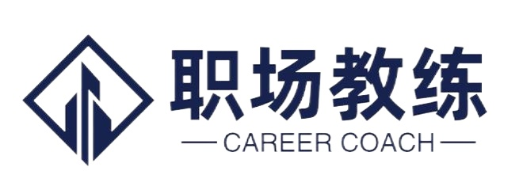
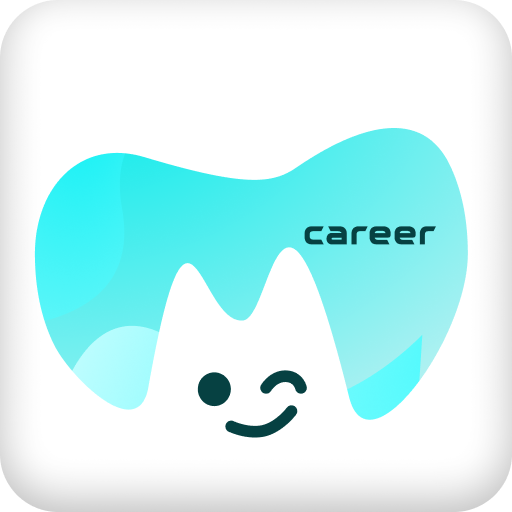
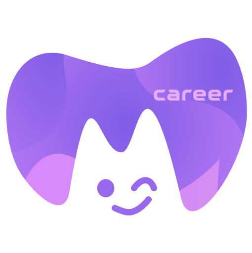
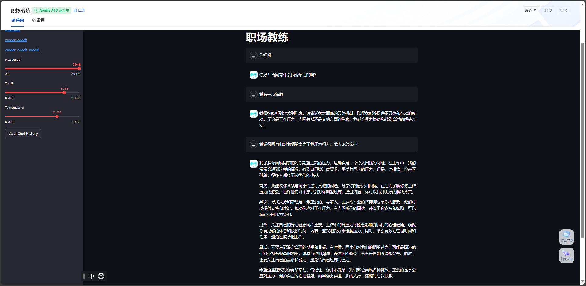

# 职场教练



应对职场上的心理焦虑，帮助在职场上获得更好的提升~

我们的智能小助手名字叫职灵，你也可以叫她为灵灵。英文名字叫cc~

下面是我们的团队成员凌感针对职灵设计的对话头像。

整体是一个心，表示心理学。里面掏空一个有带有拟人化表情的小猫，赋予一些情感特征。表情代表so easy，这都不是事~

<html>
  <table style="margin-left: auto; margin-right: auto;">
    <tr>
      <td>
        
      </td>
      <td>
        
      </td>
    </tr>
  </table>
</html>


## 成员

- 白玉
- 凌感

## 仓库地址

基础模型：[InternLM](https://github.com/InternLM/InternLM/)

代码仓库地址：[career_coach](https://github.com/BaiYu96/career_coach)

模型地址：https://www.modelscope.cn/models/baiyu96/career_coach/summary

openXLab体验地址：https://openxlab.org.cn/apps/detail/baiyu/career_caoch

## 更新日志
* 20240202-首个版本发布
* 20240214-v0.3.0模型，增加smile训练数据
* 20240221-v0.4.0模型，预训练模型使用Internlm2-chat-7b
## 功能列表

* [x] 基本问答交互
* [x] 模型自我定位认知
* [x] 通过smile模型增强模型在心理学范畴的能力
* [ ] 整理自有多轮对话数据数据集
* [ ] 外挂心理学知识知识库
* [ ] 收集真实的职场焦虑心理治疗案例
* [ ] 整理对应的训练数据
* [ ] 通过智能体框架进一步提高职场教练大模型能力

## 快速开始

```
# 下载源代码
git clone https://github.com/BaiYu96/career_coach

cd career_coach

# 安装依赖
pip install -r requirements.txt

# 启动demo示例
python start.py
```

> 如果使用的是v0.3.0的模型，请记得修改`start.py`中启动的文件为`app_internlm.py`


## 什么是职场焦虑

职场焦虑被定义为员工在工作环境中对完成工作任务时体验到的紧张和焦虑，作为一种由工作领域引发的特定情绪，职场焦虑反映了[在执行工作任务时]的情绪体验[2].职场焦虑主要聚焦于职场领域，是关于员工对[工作绩效及工作完成度]的担忧，具有明显的[诱因及指向性]，且这种[焦虑的情绪体验]会随着[任务结束或绩效达成]而逐渐降低甚至消失。

## 为什么做这件事情？

在当今快节奏、竞争激烈的职场环境中，人们经常面临着各种挑战和焦虑，这不仅对个人心理健康造成负面影响，也可能妨碍职业生涯的发展。而通过引入基于心理大模型的职场教练应用，可以为用户提供有针对性的心理支持和职业发展指导，从而创造更积极、健康、有成就感的职场体验。

## 我们想怎么做这件事情？

个性化心理辅导： 利用心理大模型的深度学习算法，为用户提供个性化的心理辅导。根据用户的职场情境和个人特点，定制心理调适方案，帮助他们更好地处理工作压力和挑战。

职业规划与提升建议： 基于用户的职业目标，为其提供科学、可行的职业规划和提升建议。通过分析用户的技能、兴趣和职业市场趋势，制定个性化的职业发展路径，助力其实现职业目标。

实时反馈与监测： 提供实时的心理状态监测和职业发展进度反馈。通过用户输入和应用反馈的数据，不断调整和优化教练方案，确保用户在职场中的成长和幸福感。

## 如何来做

情感分析和个性化建模：基于InternLM-7b大模型，通过Xtuner进行微调出一个心理大模型，从而进行情感分析，以便了解用户的情绪状态。通过对用户输入、反馈和行为的深度分析，建立个性化的心理模型，以更好地理解每个用户的独特需求和挑战。

自然语言处理（NLP）： 利用自然语言处理技术，使应用能够理解和生成自然语言。这是为了确保应用可以与用户进行自然而流畅的交流，收集关于他们职业生涯、心理状态等方面的信息。

推荐系统： 基于用户的个性化心理模型，应用推荐系统为用户提供定制的职业发展建议、心理调适策略和学习资源。这可以通过将大模型对用户的了解与职业发展知识库相结合来实现。

## 部署

通过OpenXLab进行部署



## 数据集
* 自有数据集
* 公开数据集
    * [smile](https://github.com/qiuhuachuan/smile)

##引用

```
@misc{qiu2023smile,
      title={SMILE: Single-turn to Multi-turn Inclusive Language Expansion via ChatGPT for Mental Health Support},
      author={Huachuan Qiu and Hongliang He and Shuai Zhang and Anqi Li and Zhenzhong Lan},
      year={2023},
      eprint={2305.00450},
      archivePrefix={arXiv},
      primaryClass={cs.CL}
}
```

# 致谢

<p align="center">
感谢 上海人工智能实验室的大力支持！
</p>

<p align="center">
感谢 书生·浦语团队的大力支持！
</p>

<p align="center">
感谢 OpenXLab 对项目部署的算力支持~
</p>

<p align="center">
感谢 浦语小助手 对项目的支持~
</p>

<div align="center">

  <div>&nbsp;</div>
  <div align="center">
  </div>
</div>

